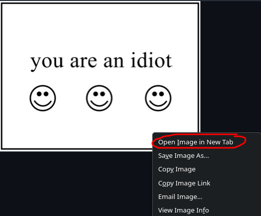
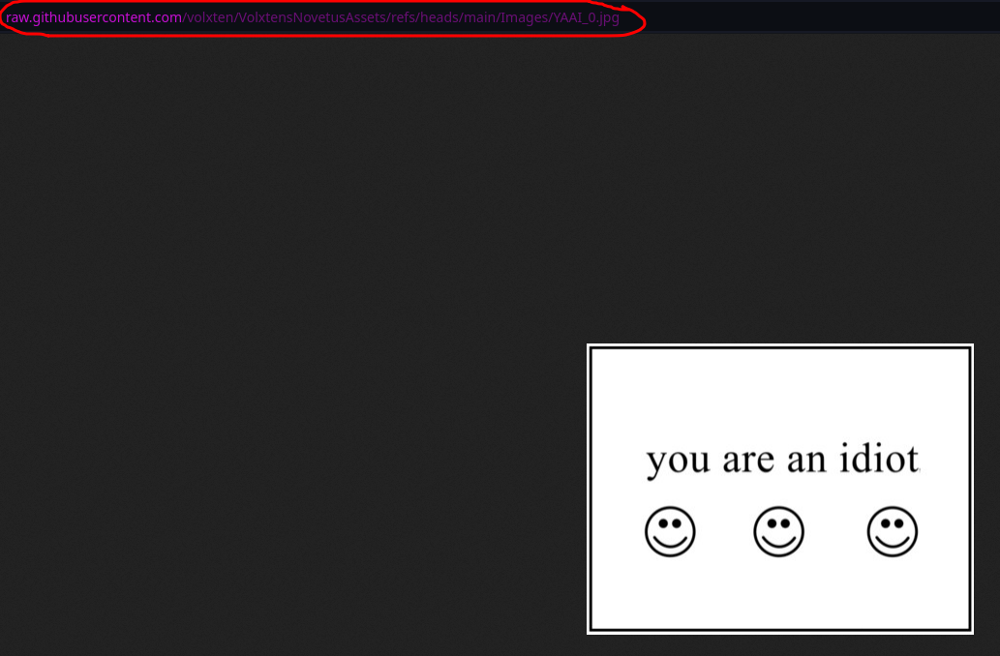
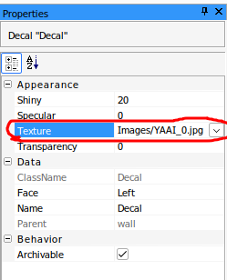

# How to use assets

open the file of your choice in the github ([shown example](https://github.com/volxten/VolxtensNovetusAssets/blob/main/Images/YAAI_0.jpg))

right click on it, and press 'open in new tab'

then copy the link shown in the address bar

and paste the copied link into the corresponding object's asset id (images would go into a decal as shown)

